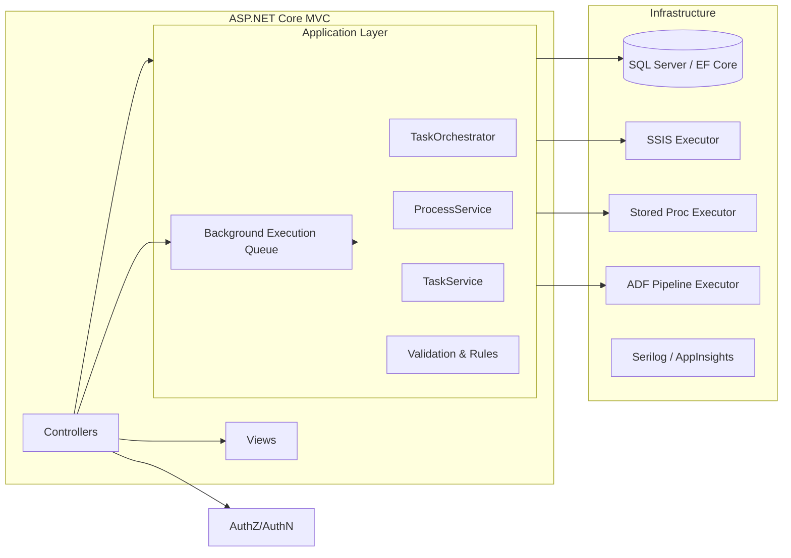

# DataPulse

DataPulse is a centralized execution and orchestration platform that allows QA and UAT teams to trigger and monitor backend data processes (SSIS packages, stored procedures, and Azure Data Factory pipelines) from a single UI.

## Objectives
- Provide a simple UI for running tasks and individual processes with parameters.
- Centralize orchestration, enforcing execution order and tracking status, duration, and diagnostics.
- Integrate with SSIS, SQL Server stored procedures, and Azure Data Factory pipelines.
- Support administrative configuration of workflows, parallelism/ordering rules, and activation.

## High-level architecture


### Solution structure (suggested)
```
src/
  DataPulse.Domain/
    Models/Task.cs
    Models/Process.cs
    Enums/ProcessType.cs
    Enums/TaskStatus.cs
  DataPulse.Application/
    Services/ITaskService.cs
    Services/IProcessService.cs
    Services/TaskService.cs
    Services/ProcessService.cs
    Orchestration/TaskOrchestrator.cs
    Execution/IExecutionDispatcher.cs
    Execution/ExecutionResult.cs
  DataPulse.Infrastructure/
    Data/DataPulseDbContext.cs
    Execution/Executors/ISSISExecutor.cs
    Execution/Executors/IStoredProcedureExecutor.cs
    Execution/Executors/IAdfPipelineExecutor.cs
    Execution/Executors/SsisCatalogExecutor.cs
    Execution/Executors/StoredProcedureExecutor.cs
    Execution/Executors/AdfPipelineExecutor.cs
    Configuration/ExecutionOptions.cs
  DataPulse.Web/
    Controllers/TaskController.cs
    Controllers/ProcessController.cs
    Controllers/AdminController.cs
    Views/Task/Index.cshtml
    Views/Task/Details.cshtml
    Views/Admin/Tasks.cshtml
    Program.cs
    appsettings.json
```

## Data model
### Tables
The platform assumes pre-existing `Task` and `Process` tables and extends them with auditing fields.

```sql
-- Task table
CREATE TABLE [dbo].[Task] (
    [TaskId] INT IDENTITY(1,1) PRIMARY KEY,
    [TaskName] NVARCHAR(200) NOT NULL,
    [Description] NVARCHAR(1000) NULL,
    [CreatedBy] NVARCHAR(100) NOT NULL,
    [CreatedOn] DATETIME2 NOT NULL DEFAULT SYSUTCDATETIME(),
    [Status] NVARCHAR(50) NOT NULL DEFAULT 'NotStarted',
    [LastRunStartTime] DATETIME2 NULL,
    [LastRunEndTime] DATETIME2 NULL,
    [LastRunBy] NVARCHAR(100) NULL
);

-- Process table
CREATE TABLE [dbo].[Process] (
    [ProcessId] INT IDENTITY(1,1) PRIMARY KEY,
    [TaskId] INT NOT NULL FOREIGN KEY REFERENCES [dbo].[Task]([TaskId]),
    [ProcessName] NVARCHAR(200) NOT NULL,
    [ProcessType] NVARCHAR(50) NOT NULL, -- SSIS, StoredProcedure, ADFPipeline
    [ExecutionOrder] INT NOT NULL,
    [TargetIdentifier] NVARCHAR(500) NOT NULL,
    [ParametersJson] NVARCHAR(MAX) NULL,
    [Status] NVARCHAR(50) NOT NULL DEFAULT 'NotStarted',
    [StartTime] DATETIME2 NULL,
    [EndTime] DATETIME2 NULL,
    [LastErrorMessage] NVARCHAR(MAX) NULL,
    [LastRunBy] NVARCHAR(100) NULL,
    [IsActive] BIT NOT NULL DEFAULT 1
);

CREATE UNIQUE INDEX IX_Process_Task_Order ON [dbo].[Process]([TaskId],[ExecutionOrder]);
```

If you need to integrate with an existing process catalog, the following tables mirror the provided schema and can be surfaced through EF Core (`ProcessMaster`, `StepMaster`, `AgentMaster`) to drive orchestration metadata without altering the legacy layout:

```sql
CREATE TABLE [process].[process_master]
(
    [process_id] INT NOT NULL IDENTITY(10001, 113) PRIMARY KEY,
    [process_name] VARCHAR(100) NOT NULL,
    [process_description] VARCHAR(MAX) NULL,
    [dependent_process_Id] INT NOT NULL DEFAULT ((0)),
    [process_type_id] INT NOT NULL DEFAULT ((0)),
    [agent_master_id] BIGINT NULL,
    [from_email_address] VARCHAR(500) NULL,
    [success_to_email_address] VARCHAR(500) NULL,
    [success_cc_email_address] VARCHAR(500) NULL,
    [failure_to_email_address] VARCHAR(500) NULL,
    [failure_cc_email_address] VARCHAR(500) NULL,
    [send_email_on_success] BIT NULL,
    [send_email_on_failure] BIT NULL,
    [can_be_rerun] BIT NULL,
    [has_event_handler] BIT NULL,
    [has_exceptions] BIT NULL,
    [create_date] SMALLDATETIME NULL DEFAULT (getdate()),
    [delete_date] SMALLDATETIME NULL,
    [is_critical] BIT NOT NULL DEFAULT ((0))
);

CREATE TABLE [process].[step_master]
(
    [step_id] INT NOT NULL IDENTITY(100, 1) PRIMARY KEY,
    [step_name] VARCHAR(1000) NOT NULL,
    [step_description] VARCHAR(MAX) NOT NULL,
    [server_name] VARCHAR(1000) NOT NULL,
    [database_name] VARCHAR(1000) NOT NULL,
    [sp_name] VARCHAR(1000) NOT NULL,
    [ssis_package_name] NVARCHAR(250) NOT NULL,
    [ssis_solution_name] NVARCHAR(250) NOT NULL,
    [process_id] INT NOT NULL,
    [is_last_step] TINYINT NOT NULL DEFAULT ((0)),
    [dependent_step_id] INT NOT NULL DEFAULT ((0)),
    [create_date] SMALLDATETIME NOT NULL DEFAULT (getdate()),
    [delete_date] SMALLDATETIME NULL,
    [execute_path] VARCHAR(MAX) NULL
);

CREATE TABLE [sql_job].[agent_master]
(
    [agent_master_id] BIGINT NOT NULL PRIMARY KEY,
    [agent_master_name] VARCHAR(500) NULL,
    [create_date] DATETIME2(3) NULL DEFAULT (getdate()),
    [delete_date] DATETIME2(3) NULL
);
```

## Key services and interfaces

- `ITaskService` / `IProcessService`: CRUD, history retrieval, and orchestration metadata.
- `IExecutionDispatcher`: Routes a process request to the correct executor (SSIS/SP/ADF) and records results.
- Executors: `ISSISExecutor`, `IStoredProcedureExecutor`, `IAdfPipelineExecutor` with implementations using SSIS Catalog/SQL Agent/dtexec, parameterized stored proc calls, and ADF REST/SDK triggers with polling.
- `TaskOrchestrator`: Coordinates ordered execution, enforces activation/continue-on-error rules, updates task status, and publishes events/logs.

## MVC controllers and Razor examples

- `TaskController`
  - `Index`: Dashboard with filters for date/status/environment.
  - `Details(int id)`: Shows ordered processes with statuses and run buttons.
  - `RunTask(int id)`: Queues full task execution and returns live status updates (SignalR/long polling).
- `ProcessController`
  - `Run(int id)`: Runs a single process with parameters.
  - `History(int id)`: Shows historical runs and diagnostics.
- `AdminController`
  - `Tasks`: CRUD for tasks and processes, activation toggles, and execution order editing.

Sample Razor snippet for task detail:
```cshtml
@model TaskDetailViewModel
<h2>@Model.Task.TaskName</h2>
<button asp-action="RunTask" asp-route-id="@Model.Task.TaskId">Run Task</button>
<table class="table">
  <thead><tr><th>Order</th><th>Name</th><th>Type</th><th>Status</th><th></th></tr></thead>
  <tbody>
  @foreach (var p in Model.Processes)
  {
    <tr>
      <td>@p.ExecutionOrder</td>
      <td>@p.ProcessName</td>
      <td>@p.ProcessType</td>
      <td>@p.Status</td>
      <td>
        <form asp-action="Run" asp-controller="Process" method="post">
          <input type="hidden" name="id" value="@p.ProcessId" />
          <button type="submit" class="btn btn-primary">Run</button>
        </form>
      </td>
    </tr>
  }
  </tbody>
</table>
```

## Execution flow
1. User triggers a task run.
2. `TaskOrchestrator` marks task InProgress and records start time.
3. Processes execute by order using `IExecutionDispatcher`, respecting activation and parallelism metadata.
4. Each execution captures start/end timestamps, duration, and errors.
5. Failures mark remaining steps blocked and update the task to Failed; successes complete the task.
6. Cancellation and continue-on-error are supported through orchestrator rules.

## Configuration
- `appsettings.json` keys: `ConnectionStrings:DataPulseDb`, `Execution:AllowParallel`, `Execution:ContinueOnError`, `SSIS` (catalog vs dtexec), `ADF` (tenant, clientId, secret, subscription, resourceGroup, factoryName).
- Use `IOptions<ExecutionOptions>` for DI and validations.
- Environment-specific connectivity:
  - The Launch database with the legacy catalog tables (`process_master`, `step_master`, `agent_master`) lives on **sql03**.
  - SSIS packages and most SQL Agent jobs reside on **sql02**. Ensure orchestrator hosts (and the pipelines) can reach both servers.
  - Store secrets such as `SQL03_LAUNCH_CONNECTION` and `SQL02_SSIS_CONNECTION` as GitHub Actions or deployment environment secrets. See `docs/ops/environment.md` for deployment notes.

## Security and auditing
- Integrate ASP.NET Core Identity or Entra ID for authentication.
- Role-based authorization to restrict execution and admin actions.
- Log user actions, parameters, and results to an audit table or centralized telemetry (App Insights/ELK).

## Background execution strategy
- Use `BackgroundService` (queued worker) or Hangfire to run long tasks outside HTTP.
- Queue work items from controllers; workers resolve services from DI and push status updates via SignalR.

## Testing and reliability
- Unit tests for orchestrator rules and dispatcher routing.
- Integration tests using in-memory or test SQL databases for repository logic.
- Simulated executors for SSIS/ADF to avoid external dependencies during tests.

## Next steps
- Scaffold the solution using `dotnet new mvc` and apply the structure above.
- Wire up DI registrations for services and executors.
- Implement real ADF/SSIS integrations and add UI polish for dashboards and history views.

## Build and test locally
1. Install .NET 10 SDK (or a compatible preview).
2. Restore, build, and test the full solution:
   ```bash
   dotnet restore DataPulse.sln
   dotnet build DataPulse.sln -c Release
   dotnet test DataPulse.sln -c Release
   ```

CI workflows (`.github/workflows/build.yml` and `.github/workflows/test.yml`) mirror these commands to validate every push and pull request.
